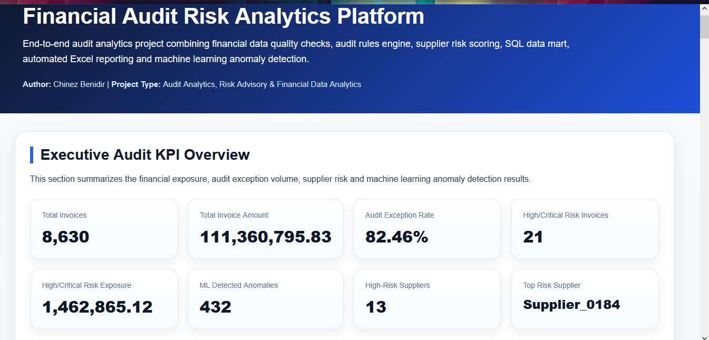
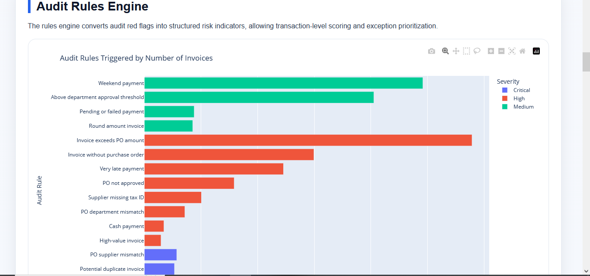
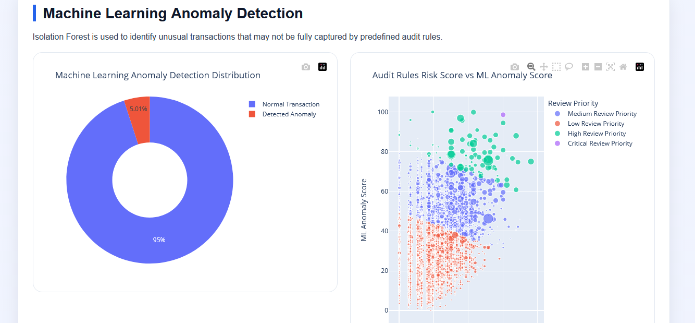
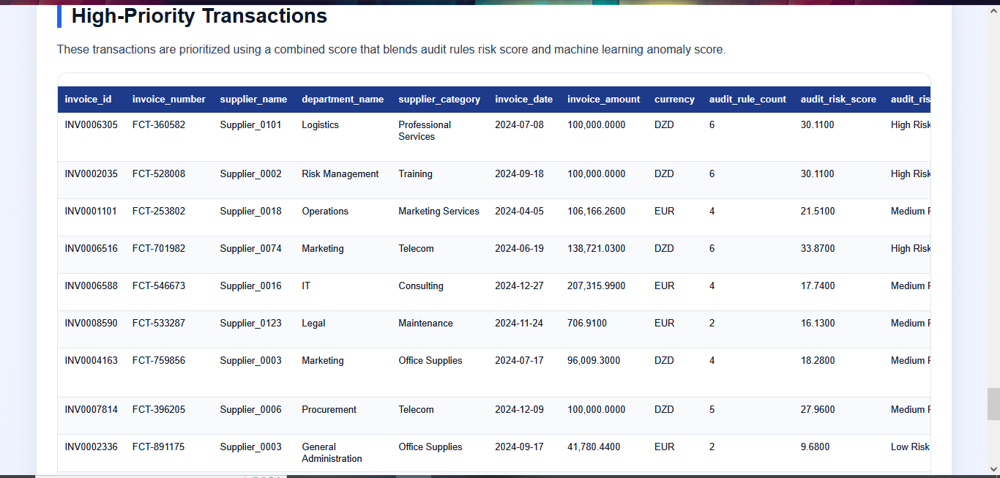

# Financial Audit Risk Analytics Platform

End-to-end financial audit analytics project designed to simulate how audit, risk advisory and consulting teams can use data analytics to detect financial control issues, prioritize audit reviews and generate business-ready reporting outputs.

This project combines data quality assessment, audit rules engine, supplier risk scoring, machine learning anomaly detection, SQL data mart creation, automated Excel reporting and an interactive HTML dashboard.

## Live Dashboard

The interactive dashboard is available here:

https://chanez985.github.io/financial-audit-risk-analytics-platform/dashboard/

## Project Objective

The objective of this project is to build a complete audit analytics workflow for accounts payable, procurement and supplier risk analysis.

The platform helps answer key audit and risk questions such as:

- Which invoices should be reviewed first?
- Which suppliers present the highest audit risk?
- Which departments show the highest concentration of exceptions?
- Which transactions are unusual according to machine learning?
- Which audit rules generate the most exceptions?
- How can audit teams prioritize testing using data?

## Business Context

The project simulates a financial audit and procurement control environment.

It is relevant for roles in:

- Audit Analytics
- Risk Advisory
- Financial Data Analytics
- Forensic Data Analytics
- Internal Audit
- Consulting Analytics
- Business Intelligence
- Data Analyst roles in Big Four firms such as KPMG, EY and PwC

## Key Features

### 1. Financial Data Creation and Loading

The project creates a structured synthetic financial dataset including:

- suppliers;
- departments;
- purchase orders;
- invoices;
- payments.

These datasets simulate realistic audit and procurement data used in financial control testing.

### 2. Data Quality Assessment

The notebook performs data quality checks such as:

- missing values;
- duplicate records;
- invalid references;
- invoices without purchase orders;
- payment inconsistencies;
- missing supplier tax IDs;
- late payments;
- weekend payments;
- payment amount mismatches.

### 3. Audit Rules Engine

A structured audit rules engine was developed to detect financial and procurement exceptions.

Examples of audit rules include:

- invoice without purchase order;
- potential duplicate invoice;
- payment before invoice date;
- high-value invoice;
- supplier missing tax ID;
- very late payment;
- payment amount mismatch;
- cash payment;
- PO supplier mismatch;
- PO department mismatch;
- invoice exceeds purchase order amount;
- PO not approved;
- invoice above department approval threshold.

Each rule is assigned:

- a rule code;
- a risk category;
- a severity level;
- a risk weight;
- a flagged invoice count;
- a financial exposure amount.

### 4. Transaction Risk Scoring

Each invoice receives an audit risk score based on triggered audit rules.

Invoices are classified into risk levels:

- No Exception
- Low Risk
- Medium Risk
- High Risk

This allows audit teams to prioritize the most important transactions for review.

### 5. Supplier Risk Scoring

Supplier-level risk scoring aggregates:

- invoice count;
- total invoice amount;
- spend share;
- exception rate;
- high-risk invoice rate;
- critical audit rule triggers;
- procurement exception rate;
- payment exception rate.

Each supplier receives:

- a supplier risk score;
- a supplier risk level;
- a primary risk driver;
- an automated audit recommendation.

### 6. Machine Learning Anomaly Detection

The project uses Isolation Forest to detect unusual transactions.

The machine learning model identifies invoices that may not be fully captured by predefined audit rules but show abnormal financial or operational patterns.

The ML output includes:

- anomaly flag;
- anomaly score;
- combined review priority score;
- review priority level.

This complements the audit rules engine and strengthens the risk prioritization process.

### 7. SQL Audit Analytics Data Mart

A SQLite data mart was created to structure the project outputs into an analytics-ready database.

The database includes:

- fact audit transactions;
- supplier dimension;
- department dimension;
- purchase order dimension;
- payment dimension;
- audit rules summary;
- supplier risk summary;
- department risk summary;
- business unit risk summary;
- monthly audit risk trend;
- ML anomaly outputs.

SQL scripts were also generated for:

- data mart schema exploration;
- executive KPI queries;
- supplier risk queries;
- audit exception queries.

### 8. Automated Excel Audit Report

An automated Excel report was generated as a client-style audit deliverable.

The workbook includes:

- executive KPIs;
- risk distribution;
- audit rules summary;
- audit categories;
- priority transactions;
- supplier risk ranking;
- department risk summary;
- business unit risk summary;
- monthly trend;
- supplier category risk;
- ML anomaly summary;
- top ML anomalies.

The Excel file is formatted with professional tables, filters, colors and charts.

### 9. Interactive HTML Dashboard

A professional interactive HTML dashboard was created using Plotly and custom HTML/CSS.

The dashboard includes:

- executive audit KPI overview;
- audit risk distribution;
- audit rules engine;
- supplier risk scoring;
- department and business unit risk;
- monthly audit risk trend;
- machine learning anomaly detection;
- high-priority transactions;
- business conclusion and recommendations.

## Dashboard Screenshots

### Executive KPI Overview



### Audit Rules Engine



### Supplier Risk Scoring


### Machine Learning Anomaly Detection



### High-Priority Transactions



## Main Results

The project generated the following key results:

- Total invoices analyzed: 8,630
- Total invoice amount: 111,360,795.83
- Paid invoices: 7,918
- Unpaid invoices: 712
- Audit exception rate: 82.46%
- High/Critical risk invoices: 21
- High/Critical risk exposure: 1,462,865.12
- ML detected anomalies: 432
- ML anomaly rate: 5.01%
- High-risk suppliers: 13
- Top risk supplier: Supplier_0184

## Business Insights

The analysis shows that the audit team should prioritize:

- high-risk invoices with multiple audit rule triggers;
- suppliers with high exception rates;
- invoices detected as anomalies by machine learning;
- departments with elevated average audit risk scores;
- procurement control exceptions such as missing purchase orders and PO mismatches;
- payment timing exceptions such as very late payments and payments before invoice date;
- approval control exceptions such as invoices above department thresholds.

## Recommended Actions

The main recommendations are:

- prioritize detailed review of high-risk invoices;
- perform supplier-level audit testing on high-risk suppliers;
- investigate transactions detected by machine learning anomalies;
- review procurement controls for invoices without purchase orders;
- monitor departments with high average risk scores;
- strengthen approval controls for invoices exceeding department thresholds;
- use the SQL data mart and Excel report to support recurring audit monitoring.

## Project Structure

```text
financial-audit-risk-analytics-platform/
│
├── dashboard/
│   └── index.html
│
├── data/
│   ├── raw/
│   └── processed/
│
├── notebook/
│   └── financial_audit_risk_analytics.ipynb
│
├── reports/
│   ├── financial_audit_risk_analytics_report.xlsx
│   ├── audit_exceptions.csv
│   ├── audit_rules_summary.csv
│   ├── supplier_risk_summary.csv
│   ├── department_risk_summary.csv
│   ├── ml_anomaly_distribution.csv
│   ├── top_anomalous_transactions.csv
│   └── other analytical outputs
│
├── screenshots/
│   ├── 01_executive_overview.png
│   ├── 02_audit_rules_engine.png
│   ├── 03_supplier_risk_scoring.png
│   ├── 04_ml_anomaly_detection.png
│   └── 05_high_priority_transactions.png
│
├── sql/
│   ├── 01_data_mart_schema.sql
│   ├── 02_executive_kpi_queries.sql
│   ├── 03_supplier_risk_queries.sql
│   └── 04_audit_exception_queries.sql
│
├── README.md
├── requirements.txt
└── .gitignore
```

## Technologies Used

- Python
- Pandas
- NumPy
- Plotly
- Scikit-learn
- Isolation Forest
- SQLite
- SQL
- OpenPyXL
- Excel reporting
- HTML
- CSS
- GitHub Pages

## Skills Demonstrated

This project demonstrates skills in:

- financial data analysis;
- audit analytics;
- risk scoring;
- procurement control testing;
- supplier risk analysis;
- anomaly detection;
- machine learning for audit;
- SQL data mart creation;
- dashboarding;
- automated Excel reporting;
- business recommendations;
- end-to-end data analytics project delivery.

## How to Run the Project

Clone the repository:

```bash
git clone https://github.com/Chanez985/financial-audit-risk-analytics-platform.git
```

Install dependencies:

```bash
pip install -r requirements.txt
```

Open the notebook:

```text
notebook/financial_audit_risk_analytics.ipynb
```

Run all notebook cells to regenerate the datasets, reports, SQL database and dashboard.

Open the dashboard locally:

```text
dashboard/index.html
```

## Portfolio Value

This project is designed to be relevant for audit, risk advisory, consulting and financial analytics roles.

It demonstrates the ability to move from raw financial data to:

- audit rules;
- risk indicators;
- supplier scoring;
- machine learning anomaly detection;
- SQL data mart;
- Excel reporting;
- interactive dashboard;
- business recommendations.

## Author

Chinez Benidir  
Data Science and Statistics Student  
GitHub: Chanez985